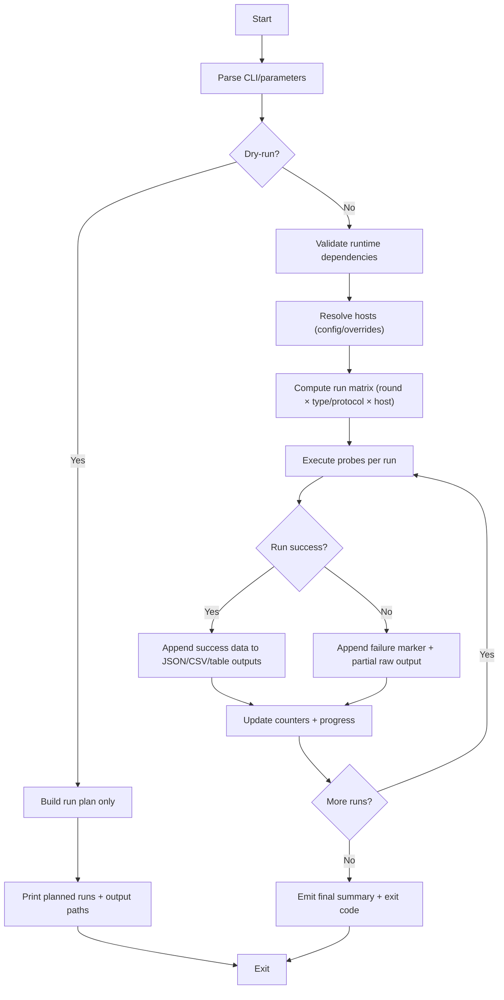
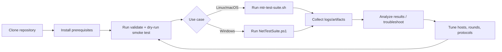

# mtr-test-suite

## Overview

Cross-platform network diagnostics:
- `mtr-test-suite.sh` for Linux/macOS (MTR matrix with JSON + summary logs)
- `NetTestSuite.ps1` for Windows PowerShell (ping/tracert/pathping/TCP+UDP probes)

## Quickstart

Prerequisites:
- Linux/macOS: Bash 4+, `mtr`
- Optional for Bash summaries: `jq`, `column`
- Windows: PowerShell 5.1+ with built-in `ping`, `tracert`, `pathping`, `Test-NetConnection`

Clone and prepare:
```bash
git clone https://github.com/sebastianspicker/mtr-test-suite.git
cd mtr-test-suite
chmod +x mtr-test-suite.sh
```

Linux/macOS dry-run (no probes):
```bash
./mtr-test-suite.sh --dry-run --no-summary
```

Linux/macOS full run:
```bash
./mtr-test-suite.sh
```

Windows PowerShell full run:
```powershell
powershell -ExecutionPolicy Bypass -File .\NetTestSuite.ps1
```

Windows/PowerShell dry-run:
```powershell
pwsh -NoProfile -NonInteractive -File .\NetTestSuite.ps1 -DryRun
```

## How It Works



Entry condition: the script starts with CLI/parameter parsing and resolves the selected execution mode.
Exit condition: dry-run exits after plan output; full run exits after summary with success/failure status.
Outputs: Bash writes JSON+table logs; PowerShell writes JSON+CSV summaries in the configured log directory.

## Lifecycle



Entry condition: cloned repository with prerequisites installed.
Exit condition: diagnostics complete and artifacts collected for analysis.
Feedback loop: tune host/round/protocol selection and rerun smoke/full diagnostics as needed.

## Configuration

Both suites read defaults from [`config/hosts.conf`](config/hosts.conf) when present.

Format:
```ini
ipv4=example.com
ipv6=example.com
```

Command-line host overrides take precedence over config defaults.

## Bash Usage

```bash
./mtr-test-suite.sh [options]
```

Key options:
- `--types CSV` select test types (for example `ICMP4,TCP4`)
- `--rounds CSV` select rounds (for example `Standard,TTL64`)
- `--hosts4 CSV` override IPv4 hosts
- `--hosts6 CSV` override IPv6 hosts
- `--list-types` print supported test types
- `--list-rounds` print supported rounds
- `--dry-run` print planned runs only
- `--no-summary` skip jq/column summary tables
- `--quiet` print warnings/failures/final summary only
- `--log-dir`, `--json-log`, `--table-log` control output locations

Examples:
```bash
./mtr-test-suite.sh --dry-run --types ICMP4,TCP4 --rounds Standard --hosts4 localhost
./mtr-test-suite.sh --log-dir /tmp/mtr-logs
./mtr-test-suite.sh --list-types
./mtr-test-suite.sh --list-rounds
```

## PowerShell Usage

```powershell
pwsh -NoProfile -NonInteractive -File .\NetTestSuite.ps1 [options]
```

Key options:
- `-Protocols @('IPv4','IPv6')` filter protocol families
- `-Rounds @('Standard','TTL64_Timeout5s')` filter diagnostic rounds
- `-HostsIPv4`, `-HostsIPv6` override hosts
- `-DryRun` print planned runs only
- `-Quiet` print warnings/failures/final summary only
- `-LogDirectory` set output directory
- `-SkipPathping` skip slow pathping stage

Examples:
```powershell
pwsh -NoProfile -NonInteractive -File .\NetTestSuite.ps1 -DryRun -Protocols IPv4 -Rounds Standard
pwsh -NoProfile -NonInteractive -File .\NetTestSuite.ps1 -HostsIPv4 localhost -HostsIPv6 localhost -SkipPathping
```

## Outputs

Bash:
- `mtr_results_<timestamp>.json.log`
- `mtr_summary_<timestamp>.log`

PowerShell:
- `net_results_<timestamp>.json`
- `net_summary_<timestamp>.csv`

Default output directory is `~/logs` (or `%USERPROFILE%\logs` with fallback resolution in PowerShell).

## Validation

```bash
make validate
./mtr-test-suite.sh --dry-run --no-summary
./mtr-test-suite.sh --list-types
./mtr-test-suite.sh --list-rounds
pwsh -NoProfile -NonInteractive -File .\NetTestSuite.ps1 -DryRun -Quiet
```

Optional local CI-style checks:
```bash
scripts/ci-local.sh --skip-install
```

## Links

- Runbook: [docs/RUNBOOK.md](docs/RUNBOOK.md)
- Contribution guide: [CONTRIBUTING.md](CONTRIBUTING.md)
- Security policy: [SECURITY.md](SECURITY.md)
- Changelog: [CHANGELOG.md](CHANGELOG.md)

## License

See [LICENSE](LICENSE).
